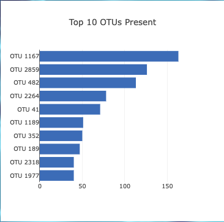
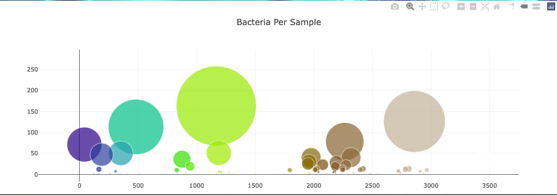
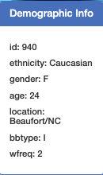

# Belly Button Biodiversity
## Background
an interactive dashboard to explore the Belly Button Biodiversity dataset, which catalogs the microbes that colonize human navels. The dataset reveals that a small handful of microbial species (also called operational taxonomic units, or OTUs, in the study) were present in more than 70% of people, while the rest were relatively rare.
 

## Getting Started
### prerequisites
+ D3
+ Plotly
+ Javascript

 
## Horizontal bar chart with a dropdown menu to display the top 10 OTUs found in that in individual.

## Bubble chart that displays each sample.

## Key-value pair from the metadata JSON object somewhere on the page.

### References
Hulcr, J. et al. (2012) A Jungle in There: Bacteria in Belly Buttons are Highly Diverse, but Predictable. Retrieved from: <a href='http://robdunnlab.com/projects/belly-button-biodiversity/results-and-data/'>http://robdunnlab.com/projects/belly-button-biodiversity/results-and-data/</a>
